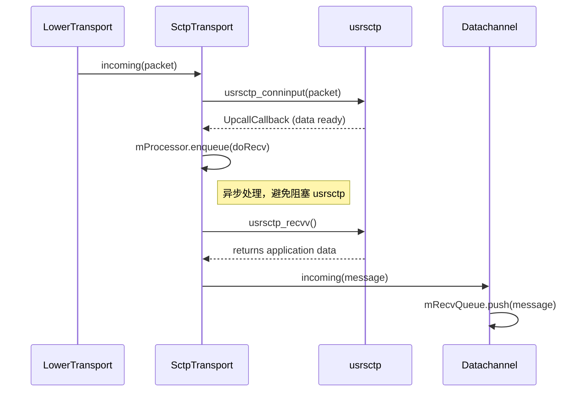

# `RECV_QUEUE_LIMIT` 常量深度分析

## 1. 引言

本文档旨在深入分析 `libdatachannel` 中 `RECV_QUEUE_LIMIT` 常量的含义、作用，及其对数据传输拥塞控制的影响。近期我们观察到一个现象：在网络条件一般、偶发丢包的情况下，当 `RECV_QUEUE_LIMIT` 设置为其默认值 `1024` 时，数据传输会出现明显的拥塞和速度下降，且难以恢复。然而，当此常量被调大至 `8092` 时，传输速度能够恢复正常。本文将结合代码，详细解释这一现象背后的技术原理。

## 2. `RECV_QUEUE_LIMIT` 的含义和作用

`RECV_QUEUE_LIMIT` 是一个在 `libdatachannel` 内部定义的常量，用于限制每个 `DataChannel` 实例的接收队列 (`mRecvQueue`) 的最大长度（以消息数量计）。

### 2.1 定义

该常量的定义位于 `src/impl/internals.hpp` 文件中：

```cpp
// src/impl/internals.hpp

const size_t RECV_QUEUE_LIMIT = 1024; // Max per-channel queue size (messages)
```

从定义和注释中可以明确看出，它的作用是为每个数据通道设置一个接收队列大小的上限，默认值为 1024 条消息。

### 2.2 使用

在 `DataChannel` 的构造函数中，`RECV_QUEUE_LIMIT` 被用来初始化 `mRecvQueue` 成员变量。`mRecvQueue` 是一个 `rtc::impl::Queue` 类型的实例，专门用于缓存从底层 SCTP 传输层接收到的数据消息。

```cpp
// src/impl/datachannel.cpp

DataChannel::DataChannel(weak_ptr<PeerConnection> pc, string label, string protocol,
                         Reliability reliability)
    : mPeerConnection(pc), mLabel(std::move(label)), mProtocol(std::move(protocol)),
      mRecvQueue(RECV_QUEUE_LIMIT, message_size_func) {
    // ...
}
```

当 `DataChannel` 接收到新的数据消息时（在 `incoming` 方法中），这些消息会被压入 `mRecvQueue` 队列中，等待上层应用程序通过 `receive()` 方法来消费。

```cpp
// src/impl/datachannel.cpp

void DataChannel::incoming(message_ptr message) {
	if (!message || mIsClosed)
		return;

	switch (message->type) {
	// ...
	case Message::String:
	case Message::Binary:
		mRecvQueue.push(message); // 将消息压入接收队列
		triggerAvailable(mRecvQueue.size());
		break;
	// ...
	}
}
```

因此，`RECV_QUEUE_LIMIT` 的直接作用就是**控制 `DataChannel` 应用层接收缓冲区的大小**。

## 3. 数据接收流程和拥塞分析

要理解 `RECV_QUEUE_LIMIT` 如何引发拥塞，我们必须先梳理清楚一条消息从网络到达应用层的完整路径。

### 3.1 数据接收流程

数据从底层的 DTLS/ICE 传输层进入，最终被 `DataChannel` 接收，其核心流程如下：

1.  **`SctpTransport` 接收数据**：`SctpTransport::incoming` 方法从下层 `Transport` 接收到数据包，并将其送入 `usrsctp` 协议栈进行处理 (`usrsctp_conninput`)。
2.  **`usrsctp` 协议栈处理**：`usrsctp` 在其内部线程中处理 SCTP 包，完成解包、排序、可靠性保证等操作。
3.  **`UpcallCallback` 通知**：当 `usrsctp` 中有数据准备好被上层读取时，它会触发 `SctpTransport::UpcallCallback` 回调。
4.  **异步读取数据**：`UpcallCallback` 会将一个 `doRecv` 任务提交到 `SctpTransport` 的内部任务队列 `mProcessor` 中，从而避免阻塞 `usrsctp` 的回调线程。
5.  **`doRecv` 读取数据**：`doRecv` 任务在 `mProcessor` 的线程中被执行，它调用 `usrsctp_recvv` 从 `usrsctp` 的 socket 缓冲区中读取应用数据。
6.  **路由到 `DataChannel`**：读取到的数据被封装成 `message_ptr`，通过注册的回调函数，最终被传递到对应的 `DataChannel::incoming` 方法。
7.  **进入接收队列**：在 `DataChannel::incoming` 方法中，消息被 `push` 进 `mRecvQueue`，等待应用层消费。

### 3.2 调用关系图

以下是上述流程的简化版序列图：



### 3.3 拥塞的根源：代码级联锁效应分析

拥塞的根本原因在于**应用层的反压（Backpressure）**，它从 `DataChannel` 的接收队列开始，逐层向上传递，最终影响到底层的 `usrsctp` 传输协议。以下是结合代码的详细流程分解：

**第 1 步：`DataChannel` 接收队列达到上限并阻塞**

当网络数据持续到达，而上层应用未能及时消费时，消息在 `DataChannel` 的 `mRecvQueue` 中积压。当队列大小达到 `RECV_QUEUE_LIMIT` 时，`mRecvQueue.push()` 方法内部的 `mPushCondition.wait()` 会阻塞当前线程。

```cpp
// 调用点: src/impl/datachannel.cpp
void DataChannel::incoming(message_ptr message) {
    // ...
    mRecvQueue.push(message); // 当队列满时，此行代码会阻塞
    // ...
}

// 阻塞实现: src/impl/queue.hpp
template <typename T> void Queue<T>::push(T element) {
	std::unique_lock lock(mMutex);
    // 当 mQueue.size() >= mLimit 时，线程在此处等待
	mPushCondition.wait(lock, [this]() { return mLimit == 0 || mQueue.size() < mLimit || mStopping; });
	// ...
}
```

**第 2 步：`DataChannel::incoming` 阻塞导致 `SctpTransport` 回调停滞**

`DataChannel::incoming` 方法是由 `SctpTransport` 通过一个 `recv` 回调函数调用的。这个回调函数本身是在 `SctpTransport::processData` 方法中被执行的。

```cpp
// src/impl/sctptransport.cpp
void SctpTransport::processData(binary &&data, uint16_t sid, PayloadId ppid) {
    // ...
    // recv() 最终会调用到 DataChannel::incoming()
    recv(make_message(std::move(data), Message::String, sid)); // 如果 DataChannel::incoming 阻塞，则此行代码也会阻塞
    // ...
}
```

因此，当 `DataChannel::incoming` 阻塞时，执行 `SctpTransport::processData` 的线程也被阻塞了。

**第 3 步：`SctpTransport::processData` 阻塞导致 `doRecv` 循环中断**

`processData` 方法是在 `SctpTransport::doRecv` 方法的 `while` 循环中被调用的。`doRecv` 负责从 `usrsctp` 的 socket 中不断地读取数据。

```cpp
// src/impl/sctptransport.cpp
void SctpTransport::doRecv() {
    // ...
    try {
        // 这个循环负责持续从 usrsctp 接收数据
        while (state() != State::Disconnected && state() != State::Failed) {
            // ...
            ssize_t len = usrsctp_recvv(mSock, ...); // 从 usrsctp 读取数据
            // ...
            if (flags & MSG_EOR) {
                // ...
                // 如果 processData 阻塞，整个 while 循环将停滞在此处，无法继续调用 usrsctp_recvv
                processData(std::move(message), info.rcv_sid, PayloadId(ntohl(info.rcv_ppid)));
            }
        }
    } catch (const std::exception &e) {
        // ...
    }
}
```

当 `processData` 被阻塞后，`doRecv` 的 `while` 循环就无法继续下一次迭代。这意味着 `SctpTransport` 停止了对 `usrsctp_recvv` 的调用，即**停止了从 `usrsctp` 的接收缓冲区中读取数据**。

**第 4 步：`usrsctp` 接收缓冲区溢出，触发拥塞控制**

`SctpTransport` 停止读取数据，但网络数据仍在通过底层 `DTLSTransport` 到达并被送入 `usrsctp` 的 socket 缓冲区。由于上层无人读取，这个缓冲区会迅速被填满。

对于 SCTP 协议而言，当其接收缓冲区满了之后，它会向发送方报告一个接收窗口（rwnd）大小为 0。这是一个标准的流量控制机制，它告诉发送方：“我已无法再接收任何数据，请停止发送”。

发送方的 SCTP 协议栈收到这个零窗口通告后，会立即停止发送数据。同时，这种接收端无法处理数据的情况会被 `usrsctp` 的拥塞控制算法（例如，类似于 TCP 的 CUBIC 或 Reno）视为网络拥塞的强烈信号。因此，它不仅会停止发送，还会大幅减小其拥塞窗口（cwnd），进入拥塞避免或慢启动阶段。

**结论：**

这个级联效应清晰地表明，一个在应用层 `DataChannel` 中设置得过小的 `RECV_QUEUE_LIMIT`，如何通过一系列的阻塞调用，最终导致了底层传输协议 `usrsctp` 做出“网络发生严重拥塞”的判断，从而引发了我们观察到的速度骤降且难以恢复的现象。问题的根源并非真正的网络拥塞，而是应用层的处理能力与网络数据到达速率之间的“缓冲带”不足。

## 4. 为什么调大 `RECV_QUEUE_LIMIT` 可以恢复速度

理解了拥塞的成因后，调大 `RECV_QUEUE_LIMIT`（例如从 1024 到 8092）为什么能恢复速度就显而易见了。

其核心原理在于**增大应用层缓冲，解耦应用层处理速度和网络层接收速度**。

1.  **提供更大的缓冲空间**：更大的 `RECV_QUEUE_LIMIT` 意味着 `mRecvQueue` 可以容纳更多的消息。当网络出现瞬时数据突发时，这个更大的队列可以有效地吸收这些消息，而不会立即被填满。
2.  **避免 `push` 操作阻塞**：由于队列不容易被填满，`DataChannel::incoming` 在调用 `mRecvQueue.push()` 时就不会被阻塞。
3.  **保证 `SctpTransport` 持续读取**：`SctpTransport` 的 `doRecv` 任务能够持续、顺畅地执行，不断地从 `usrsctp` 的 socket 缓冲区中将数据读取出来。
4.  **避免触发底层拥塞控制**：只要 `SctpTransport` 能及时清空 `usrsctp` 的接收缓冲区，`usrsctp` 就不会认为接收端出现了拥塞，因此也不会通知发送端减小发送窗口。

通过这种方式，`mRecvQueue` 扮演了一个蓄水池的角色。它允许网络层以最快的速度接收数据，同时给了应用层更多的时间来处理这些数据，从而有效地应对了网络抖动和应用层处理速度波动带来的影响，维持了数据传输的稳定和高速。

## 5. 潜在影响探讨

虽然增大 `RECV_QUEUE_LIMIT` 可以有效地解决特定场景下的拥塞问题，但这并不是一个没有成本的解决方案。我们需要意识到其潜在的影响：

1.  **内存消耗增加**：最直接的影响就是内存消耗。`mRecvQueue` 中缓存的是 `message_ptr`，每个 `message` 都持有一定大小的内存块。如果队列长度从 1024 增加到 8092，并且队列经常处于满负荷状态，那么每个 `DataChannel` 的内存占用都会显著增加。在有大量并发 `DataChannel` 的场景下，这可能会成为一个问题。
2.  **延迟增加**：虽然传输速度恢复了，但消息在 `mRecvQueue` 中排队的平均时间可能会增加。对于需要低延迟的应用（例如实时游戏、远程控制），过大的缓冲区可能会引入不可接受的延迟。
3.  **掩盖应用层性能问题**：如果拥塞的根本原因是应用层消费能力不足，那么增大缓冲区只是治标不治本，甚至可能掩盖了应用层需要优化的性能瓶颈。

## 6. 结论与建议

`RECV_QUEUE_LIMIT` 是一个关键的性能参数，它直接决定了 `DataChannel` 应用层缓冲区的大小，对拥塞控制有着至关重要的影响。

-   当其值**过小**时，在网络不稳定或应用层处理稍有延迟的情况下，容易导致接收队列阻塞，从而错误地触发底层 SCTP 的拥塞控制，导致传输速度急剧下降。
-   当其值**过大**时，虽然可以有效缓冲网络抖动，维持高速传输，但会带来更高的内存消耗和潜在的延迟增加。

**给内部开发者的建议**：

-   `RECV_QUEUE_LIMIT` 的默认值 `1024` 在理想网络下是合理的，但在真实世界的网络环境中可能过于保守。
-   当遇到不明原因的速度下降时，检查 `DataChannel` 的 `availableAmount()`，如果发现该值长时间维持在 `RECV_QUEUE_LIMIT` 附近，那么很可能就是此参数过小导致的拥塞。
-   在调整此值时，需要根据应用的具体场景进行权衡。对于需要高吞吐量、对延迟不甚敏感的文件传输等场景，可以适当增大此值（例如 4096 或 8092）。对于需要低延迟的实时应用，则应谨慎调整，并考虑优化应用层的消息消费速度。
-   长远来看，可以考虑将此值做成可配置的选项，而不是一个编译时常量，以便于根据不同的部署环境和应用需求进行灵活调整。
